# Spirucraft — Website

Official marketing/product website for **Spirucraft** — Manufacturer, Exporter and Supplier of Organic Spirulina Powder and Phycocyanin Pigment Powder, based in Medak, Telangana.

A fully static, hand-built multi-page site — no build tools, no frameworks, no backend. Just clean HTML, CSS, and vanilla JavaScript.

## 📁 Project Structure

```
.
├── index.html                                  # Home page
├── about-us/
│   └── index.html                               # About page
├── contact-us/
│   └── index.html                               # Contact page
├── products/
│   ├── index.html                               # Products overview
│   ├── organic-spirulina-powder/index.html
│   ├── phycocyanin-pigment-powder/index.html
│   └── dried-spirulina-powder/index.html
├── style.css                                    # All site styling
├── script.js                                    # Site interactivity (WhatsApp enquiry, modals, forms)
├── sitemap.xml                                  # SEO sitemap
├── robots.txt                                   # Crawler rules
├── _redirects                                   # Cloudflare Pages 301 redirects (old → new clean URLs)
├── brochure.pdf                                 # Downloadable company/product brochure
├── logo.png / wordmark.png                      # Brand assets
└── facility-*.jpg, product-*.jpg, plant-layout.jpg, rooted-in-telangana.jpg
                                                   # Facility and product photography
```

## 📸 Screenshots

| | |
|---|---|
| **Home — Hero** | **Home — Process (Pond to Pigment)** |
| 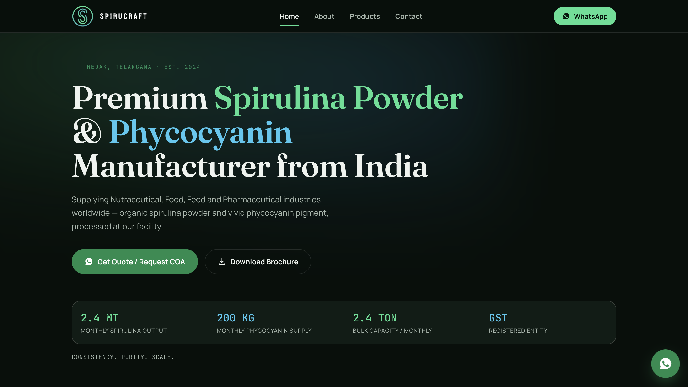 | 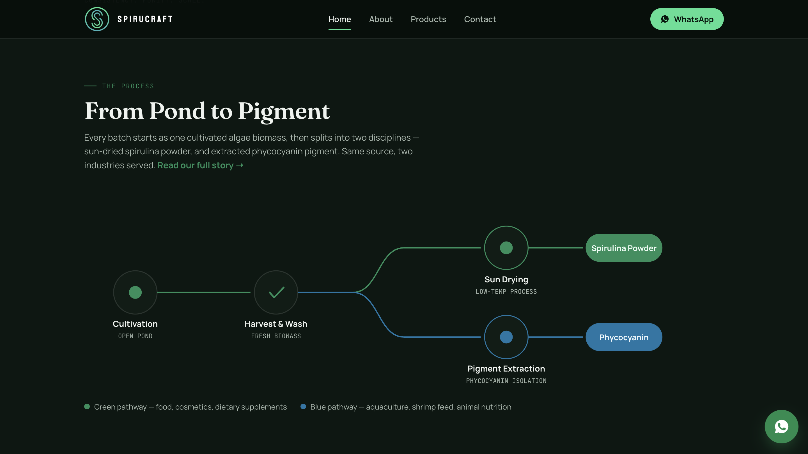 |
| **Home — Products** | **Home — About preview** |
| 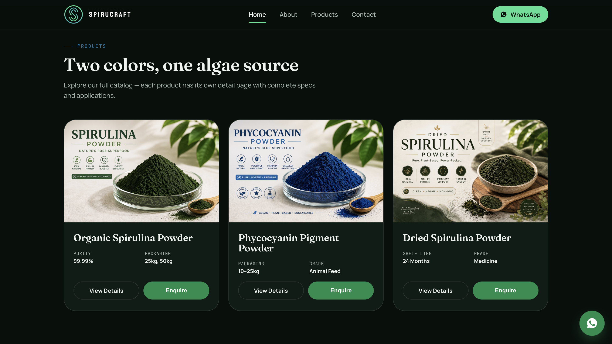 | 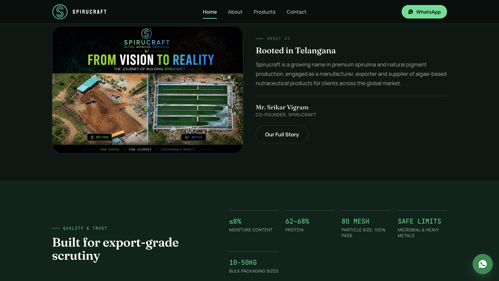 |
| **Home — CTA & Footer** | **About — Our Story** |
| 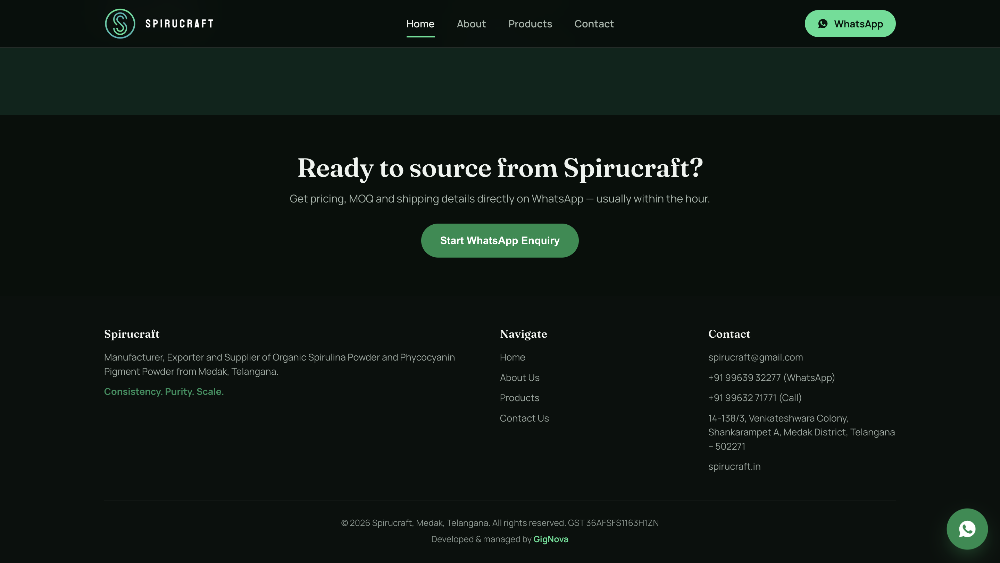 | 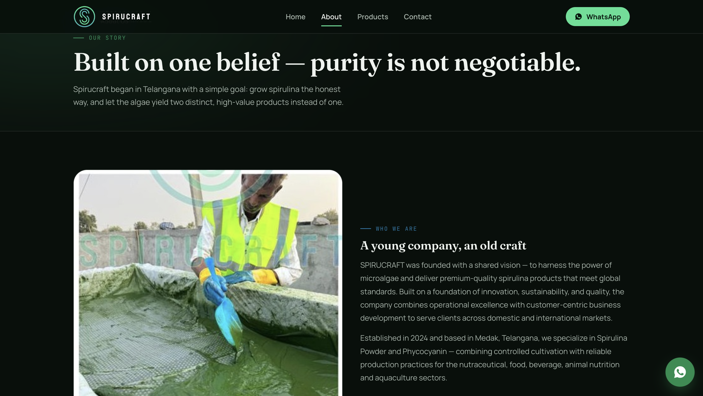 |
| **About — Founders** | **About — Vision & Mission** |
| 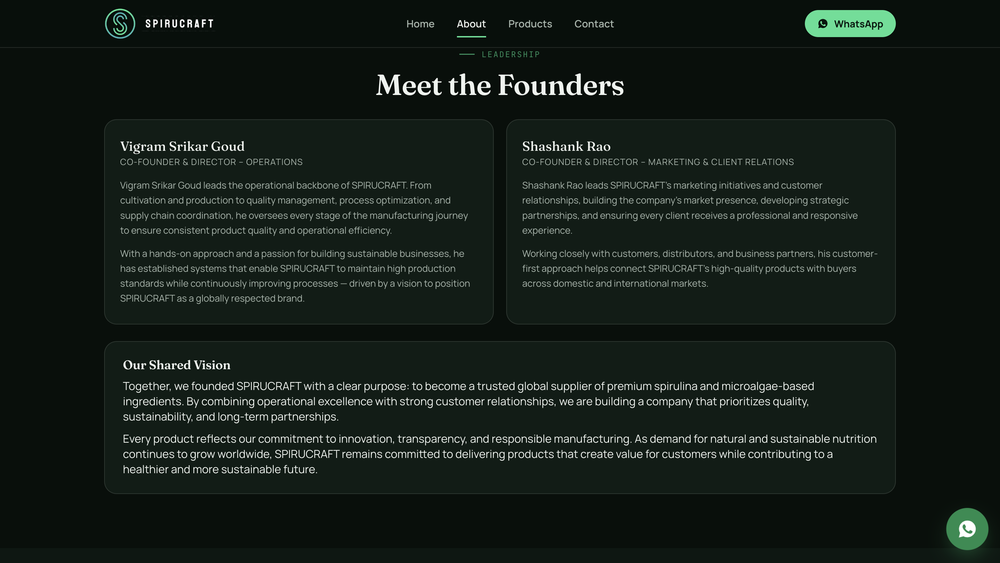 | 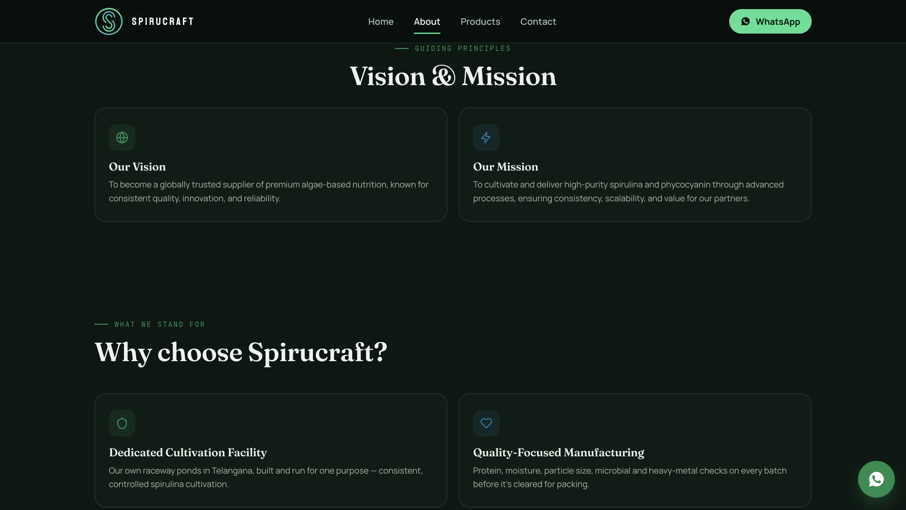 |
| **About — Why Choose Spirucraft** | **About — Trust** |
| 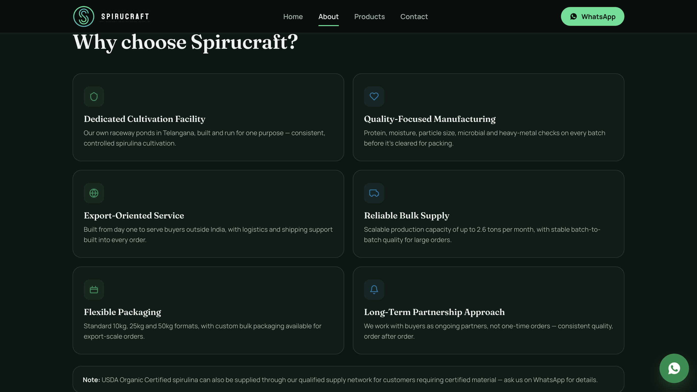 | 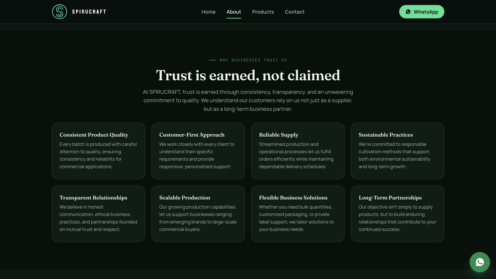 |
| **About — Documentation & QA** | **About — Process Stages** |
| 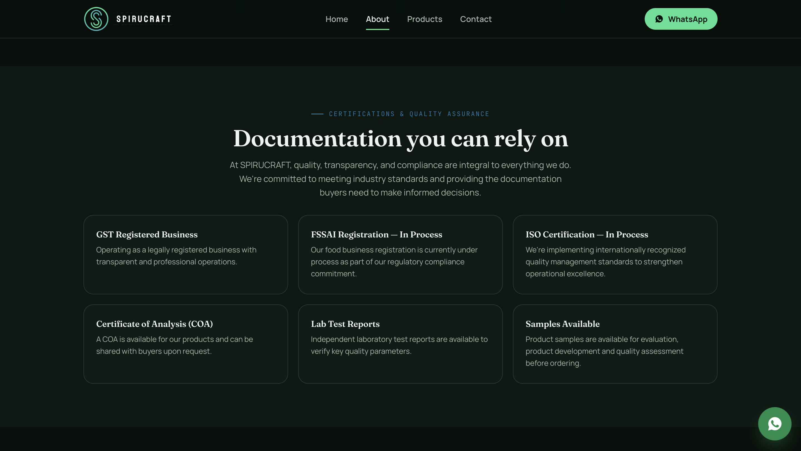 | 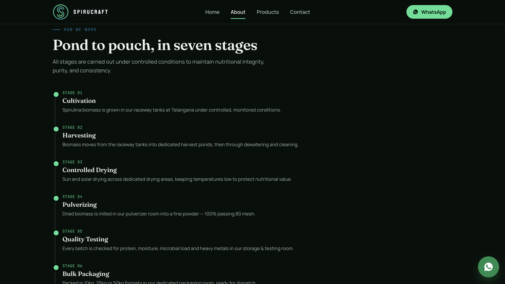 |
| **About — Facility Photos** | **Products — Listing** |
| 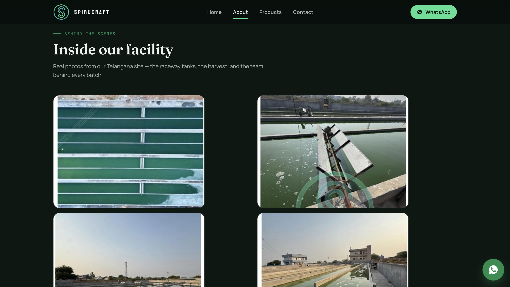 | 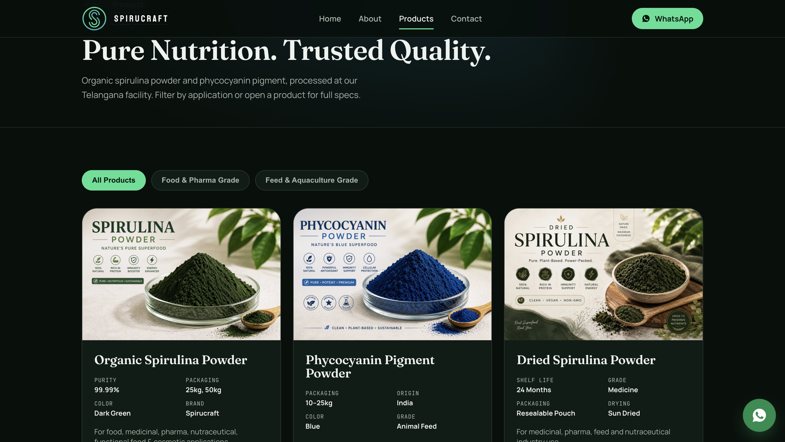 |
| **Products — Applications** | **Contact — Page** |
| 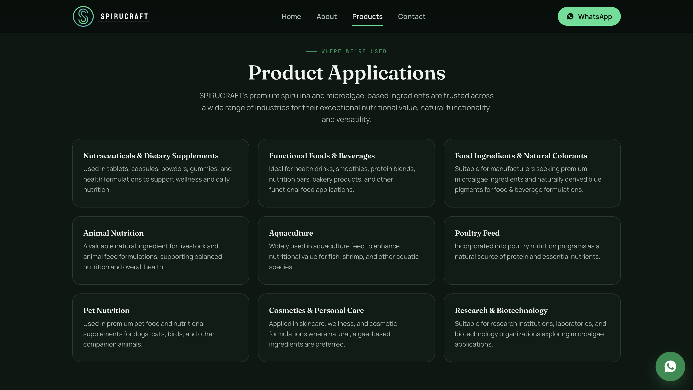 | 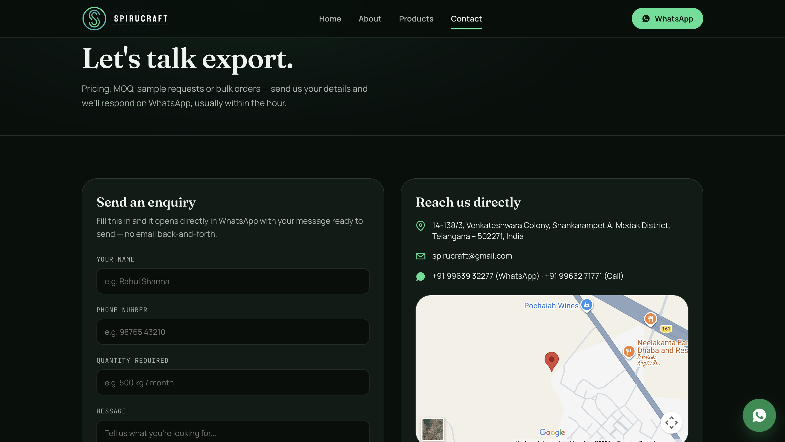 |
| **Contact — FAQ** | |
| 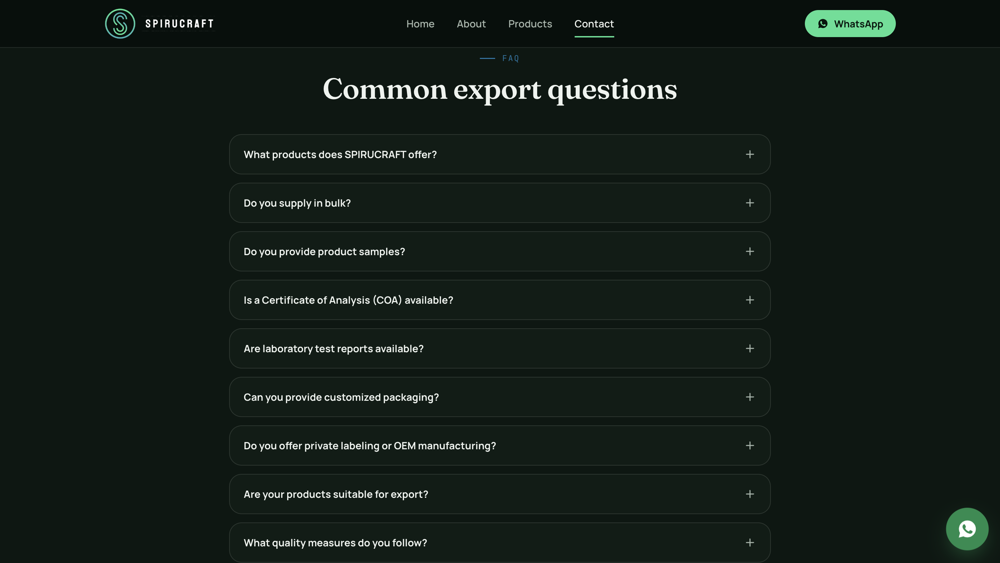 | |

## ✨ Features

- Fully responsive, multi-page static site with clean SEO-friendly URLs (`/about-us/`, `/products/organic-spirulina-powder/`, etc.)
- Product pages for each Spirucraft product line: Organic Spirulina Powder, Phycocyanin Pigment Powder, and Dried Spirulina Powder
- Enquiry flow that opens a pre-filled **WhatsApp chat** — no backend or database required
- Downloadable company brochure (`brochure.pdf`)
- SEO basics: sitemap, robots.txt, meta descriptions
- Cloudflare Pages `_redirects` file mapping legacy URLs to the current clean URL structure

## 🚀 Running Locally

No build step needed — it's plain HTML/CSS/JS. Just serve the folder:

```bash
# Option 1: Python
python3 -m http.server 8000

# Option 2: Node (via npx)
npx serve .
```

Then open `http://localhost:8000` in your browser.

## 🛠️ Deployment

This site is built for **Cloudflare Pages** (see `_redirects` for the redirect rules), but since it's fully static it can be deployed as-is to any static host — Netlify, Vercel, GitHub Pages, or a plain VPS/Nginx setup.

## 📬 Enquiries

All "Enquire" / "Get Quote" / contact form actions open a pre-filled WhatsApp chat via `script.js` (no server involved — the WhatsApp number is set client-side). There is no exposed API key or backend secret anywhere in this repo.

## 📄 License

All rights reserved © Spirucraft. This code is provided for reference/portfolio purposes; please don't reuse the branding, product photography, or copy without permission.
